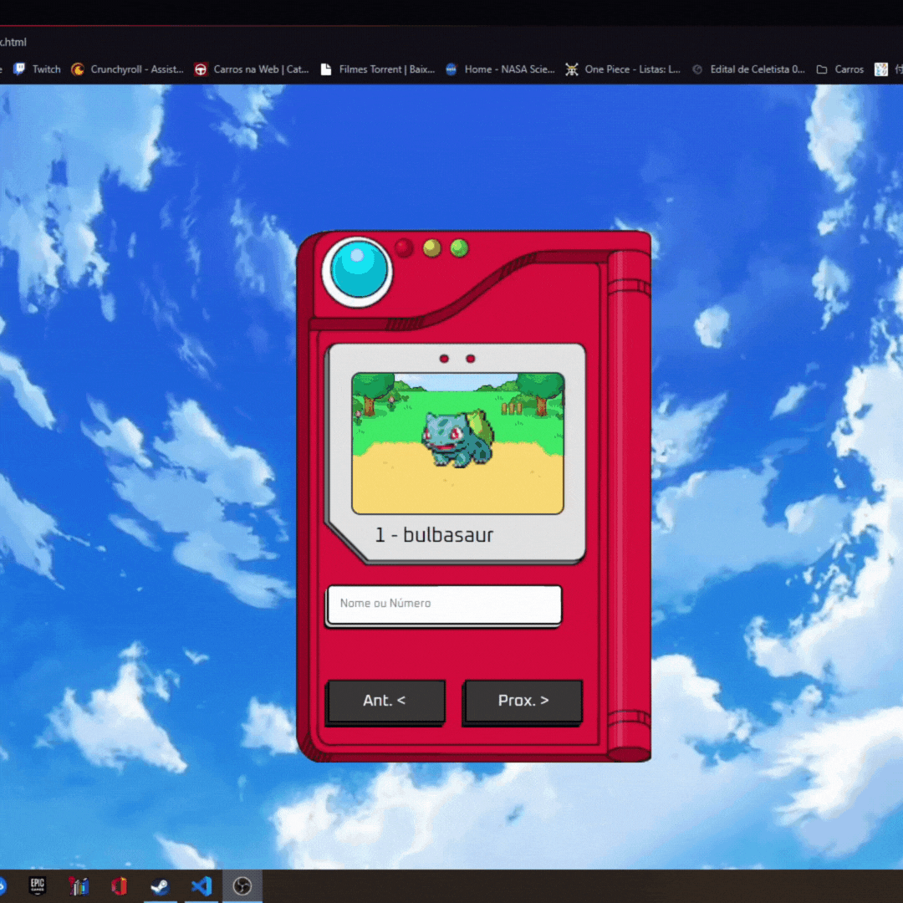

<h1 align="centre">Desafio Pokedex</h1>

Neste projeto me desafiei a utilizar uma estrutura de HTML e CSS simples porém funcional, e principalmente uma estrutura JavaScript com a minha primeira integração com API, utilizei uma API conhecida pelos desenvolvedores (api em questão https://pokeapi.co ) a PokeApi, meu desafio foi resgatar da API por meio do JavaScript o **ID (Seu número) do pokemon e seu Nome** e tornando os botões funcionais para que o usuario tenha uma maior precisão ao pesquisar pelos pokemons, o projeto foi iniciado no dia **16/08/2022** e finalizado **Sete dias depois** no dia **22/08/2022**.

<h1 align="centre">Atualização da Pokedex</h1>
Estou retomando esse projeto com o intuito de aplicar conhecimentos de Jquery para alterar a estilização do site conforme o usuario pesquisa pelos pokemons, fazendo com que a imagem de fundo mude de acordo com o elemento do Pokemon, para o dia 29/09 estou atras de imagens e buscando conhecimento sobre Jquery para a implementação das novas interações que pretendo fazer.

No dia 02/10 implementei a resposta da api para que ela mostre o tipo do pokemon, entretanto estou analisando a possibilidade de mudar 
a maneira como será verificado o resultado da api para a mudança do background.

No dia 03/10 decidi fazer a mudança utilizando JavaScript por ter melhor usabilidade para a o projeto.

Esse projeto tem como por propósito os seguintes objetivos:

* - Criação de páginas.
* - Prática de JavaScript
* - Integração com API
* - HTML e CSS funcionais para o usuário.

# Gif do resultado

Divisões do projeto</h2>

Como o projeto era muito desafiador para meus conhecimentos no começo, resolvi dividir o projeto em três etapas e organizar para fluir da maneira como queria, as etapas foram as seguintes:

### Primeira etapa
Construir a estrutura HTML.
Construir Estrutura CSS

### Segunda etapa
Construir o JavaScript
Implementação de uma API na qual nunca trabalhei antes.

### Terceria etapa
Utilizar o CSS para uma melhor experiencia do usuário.

<h2 align="centre">Tecnologias Usadas</h2>

     
 
          
       
       
    

<h3 align="centre"> Link para acessar o projeto</h3>

https://laetuus.github.io/pokedexDesafio/index.html

